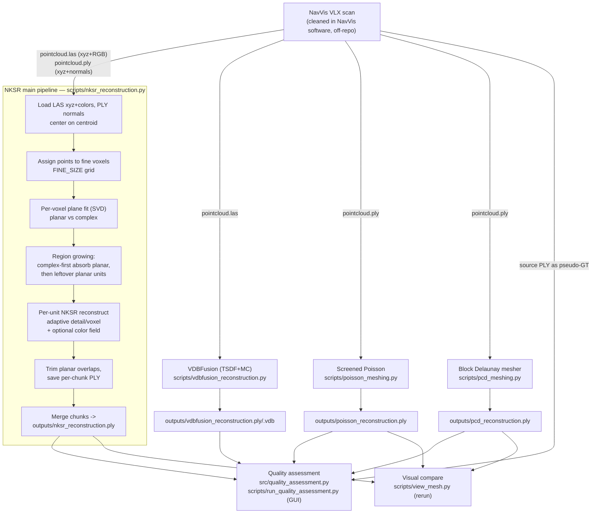

# REPO_GUIDE.md

Onboarding guide for the ETH Zurich 3D Vision project **"LiDAR to Mesh using Neural Kernel Surface Reconstruction"**. Written for someone with general ML/CV background who has not seen this code. Cross-referenced against [`Proposal.pdf`](Proposal.pdf).

> Conventions: file/function references are clickable relative links like [`scripts/nksr_reconstruction.py`](scripts/nksr_reconstruction.py). Claims I could not verify from code alone are marked **(unclear — verify with team)**.

---

## 1. What this repo does

The project converts large-scale **indoor LiDAR point clouds** captured with a **NavVis VLX** mobile mapping scanner (building-scale, millions of points, uneven density, occlusions) into **explicit triangle meshes**. The core meshing method is **Neural Kernel Surface Reconstruction (NKSR)** — a learned-kernel implicit surface method designed to scale to large, noisy point clouds. The two research questions from the proposal are (1) **scalability** of NKSR to building-scale scans within practical runtime/memory, and (2) **quality/robustness** versus classical TSDF-style baselines.

The main contribution in this repo is *not* re-implementing NKSR but wrapping it in a **geometry-aware chunking pipeline** so it can run on a whole building scan. The scene is split into fine voxels, each voxel is classified planar vs. complex via PCA/SVD, and chunks are merged by **region growing**: complex regions (furniture, objects) grow first and absorb adjacent flat walls/floors so NKSR always sees full context at edges; leftover flat chunks form their own coarse, cheap reconstruction units. Each unit is reconstructed by NKSR at an adaptive resolution and the per-unit meshes are merged into one PLY.

Alongside the NKSR pipeline there are **baseline reconstructors** (VDBFusion = TSDF fusion + Marching Cubes; Screened Poisson; a Delaunay/visibility block mesher via `pcdmeshing`) and a standalone **mesh quality-assessment** tool (Tkinter GUI + metrics library) that compares a reconstructed mesh against the source point cloud (used as a pseudo-ground-truth, since no true ground truth exists — see proposal §5).

> **Important gap vs. proposal:** the proposal repeatedly centers the contribution on integrating NKSR with **fVDB** sparse voxel grids for chunked processing. In the current code there is **no fVDB usage** — chunking is done with a custom NumPy/dict region-growing scheme, and NKSR's own internal sparse structure does the rest. See §8 and §11.

---

## 2. Pipeline overview



---

## 3. Directory structure

```
3d-vision/
├── Proposal.pdf                 Project proposal (read for research goals/RQs)
├── README.md                    Setup + NKSR/VDBFusion run instructions (partly stale — see §8)
├── REPO_GUIDE.md                This document
├── pyproject.toml               Installs src/ as the `3d_vision` package (setuptools)
├── requirements.txt             Conda explicit env dump — MISSING torch/nksr/fvdb/vdbfusion (see §5)
├── .pre-commit-config.yaml      Formatting/lint hooks (run via `pre-commit install`)
├── configs/                     YAML configs, one per reconstructor (+ a stale testing config)
├── scripts/                     All runnable entry points (pipeline + baselines + tools)
├── src/
│   ├── 3d_vision/__init__.py    Empty package marker (the installed package; effectively unused)
│   └── quality_assessment.py    Metrics library (distance, F-score, residual dist, Plotly viz)
└── docs/quality_assessment/     README + minimal requirements for the QA tool
```

There is no `outputs/`, `data/`, or `results/` in git (`.gitignore` excludes `outputs/`); these are created at runtime. Input data lives outside the repo on the HPC filesystem / Google Drive (see §6).

---

## 4. Script-by-script breakdown

### Stage A — Data loading & preprocessing
Performed *inside* each reconstruction script (no shared data-loading module). NavVis-side cleaning happens off-repo in NavVis software (proposal §4.2). Boundary formats:
- `pointcloud.las` — xyz + 16-bit RGB (`las.red/green/blue`, scaled by `/65535`).
- `pointcloud.ply` — xyz + **precomputed normals** (NavVis-exported; read via Open3D `pcd.normals`). Normals are *not* re-estimated — see README "Normals from PLY".

### Stage B — NKSR main pipeline (the core deliverable)

[`scripts/nksr_reconstruction.py`](scripts/nksr_reconstruction.py) (468 lines, top-level script, no `__main__` guard, **must be run from repo root** because it opens `configs/nksr_config.yaml` by relative path).

- **Inputs:** `pointcloud_las` (xyz+color), `pointcloud_ply` (normals), all paths/params from [`configs/nksr_config.yaml`](configs/nksr_config.yaml).
- **Output:** `outputs/nksr_reconstruction.ply` (merged colored mesh) + per-unit PLYs in `outputs/chunks/` (wiped at start).
- Key functions:
  - `fit_plane(pts)` (line 90) — SVD plane fit; `residual = s[-1]/s[0]` is the planarity score (small ⇒ flat).
  - `normals_similar` (line 98), `planes_coplanar` (line 102) — merge predicates for planar region growing.
  - `get_neighbours` (line 129) — 6-connected voxel neighbours.
  - Region growing: complex-first BFS with extent cap `MAX_EXTENT_CHUNKS` (lines 140–196), then unlimited planar growing (lines 216–253). Produces `regions = [(keys, is_complex), ...]`.
  - `run_nksr(pts, nrm, clr, detail, mise, vox_size)` (line 264) — moves arrays to CUDA, calls `nksr.Reconstructor.reconstruct(...)`, optionally attaches `nksr.fields.PCNNField` color texture, extracts mesh via `field.extract_dual_mesh(mise_iter=...)`. Catches CUDA OOM / RuntimeError and returns `None`.
  - `smart_subsample` (line 292) — Open3D voxel downsample loop until ≤ `PLANAR_MAX_PTS` (planar units only).
  - `save_mesh` (line 314) — writes a per-unit PLY with optional vertex colors.
  - `compute_planar_trim_bbox` (line 330) — shrinks a planar unit's bbox away from any complex unit's bbox so planar and complex meshes don't overlap.
  - Reconstruction loop (lines 354–453): complex units use `COMPLEX_*` params (high detail, fine voxel, no trim); planar units expand by `PLANAR_OVERLAP_M`, subsample, reconstruct at coarse detail, then trim against complex bboxes and remap faces.
  - Merge (lines 456–467): `o3d` concatenation of all chunk PLYs.
- **Calls:** `nksr`, `torch`, `laspy`, `open3d`, `numpy`, `yaml`. **Called by:** nothing (manual `python scripts/nksr_reconstruction.py`).

[`scripts/testing_nksr_recon.py`](scripts/testing_nksr_recon.py) — **currently byte-identical** to `nksr_reconstruction.py` (verified via `diff`: IDENTICAL). Historically a divergent experimental fork (was `nksr_fvdb_recon.py`); it has since converged. Treat as redundant / dead duplicate — **(verify with team whether this should be deleted or is a placeholder for experiments)**.

### Stage C — Baselines

[`scripts/vdbfusion_reconstruction.py`](scripts/vdbfusion_reconstruction.py) — **TSDF fusion + Marching Cubes baseline** (proposal's "TSDF-based reconstruction using Marching Cubes"). Driven by [`configs/vdbfusion_config.yaml`](configs/vdbfusion_config.yaml).
- `build_points(las_path, downsample_voxel)` (line 14) — loads LAS, drops non-finite, optional Open3D downsample.
- `reconstruct_once(...)` (line 40) — builds a `vdbfusion.VDBVolume`, `integrate()`s the whole cloud from a single fixed sensor origin (`static_mode.fixed_origin`), extracts a `.vdb` grid and a triangle mesh, writes `.ply` + `.vdb`.
- `write_ply_uint` (line 118) — alternative `plyfile`-based writer (currently commented out at the call site, line 109).
- `main()` (line 138) — supports a **parameter sweep** (`sweep.enabled`) over `downsample_voxel × voxel_size × sdf_trunc × min_weight` via `itertools.product`; sweep outputs go to `outputs/sweeps/`.
- **Output:** `outputs/vdbfusion_reconstruction*.ply` / `.vdb`.

[`scripts/run_vdbfusion.py`](scripts/run_vdbfusion.py) — thin subprocess wrapper that invokes `vdbfusion_reconstruction.py` from the repo root. **Bug:** line 40 references an undefined name `start` → `NameError` at the end of a successful run (cosmetic; reconstruction itself completes). Prefer running `vdbfusion_reconstruction.py` directly.

[`scripts/mesh_to_dataset.py`](scripts/mesh_to_dataset.py) — utility (vendored from VDBFusion's MIT example). `mesh_to_tsdf(filename, scan_count, scan_resolution)` uses `mesh_to_sdf` to render virtual depth scans of an input mesh and writes `results/000000.ply…` + `results/poses.txt` (a KITTI-style posed-scan dataset). Not wired into the current `vdbfusion_reconstruction.py` (which only does single-origin LAS integration). Likely from an earlier KITTI-style experiment **(verify with team)**. Uses `argh`, `mesh_to_sdf`, `trimesh` — none in `requirements.txt`.

[`scripts/poisson_meshing.py`](scripts/poisson_meshing.py) — **Screened Poisson baseline** via `o3d…create_from_point_cloud_poisson`. Reads [`configs/poisson_config.yaml`](configs/poisson_config.yaml), trims low-density vertices by percentile, transfers color from source points via `scipy` KDTree NN. Output `outputs/poisson_reconstruction.ply`.

[`scripts/pcd_meshing.py`](scripts/pcd_meshing.py) — block Delaunay/visibility mesher via the `pcdmeshing` package (`run_block_meshing`). **No config** — input path, block size (20 m), and options are hardcoded. Output `outputs/pcd_reconstruction.ply`. Not one of the proposal's named baselines; extra comparison method. Note: the proposal lists **Ball Pivoting Algorithm (BPA)** as a baseline — **BPA is not implemented anywhere in the repo** (see §8).

### Stage D — Visualization

[`scripts/view_mesh.py`](scripts/view_mesh.py) — loads the three meshes and logs them to a [`rerun`](https://rerun.io) viewer for side-by-side visual comparison. **Bug:** line 14 reads `outputs/possoin_reconstruction.ply` (misspelled "possoin") while `poisson_meshing.py` writes `outputs/poisson_reconstruction.ply` → this script will fail unless the file is renamed. Paths are hardcoded.

### Stage E — Quality assessment / evaluation

[`src/quality_assessment.py`](src/quality_assessment.py) (699 lines) — metrics library. Public entry point is `evaluate_mesh(mesh, ground_truth_points, …)` (line 462). Internal helpers:
- `_load_ply_mesh` / `_load_ply_pointcloud` (lines 28, 46) — trimesh loaders (PLY only).
- `_spatial_voxel_sample` (line 63) — voxel-grid uniform subsampling so dense regions don't dominate metrics.
- `_compute_point_to_mesh_distance` (line 113) — exact point-to-triangle distance via `trimesh.proximity.closest_point` on sampled cloud points.
- Metrics: `_hausdorff_distance` (148), `_rmse_mae` (162), `_surface_smoothness` (173, *defined but unused by* `evaluate_mesh`), `_mesh_quality_stats` (195, also unused — `evaluate_mesh` inlines its own copy), `_mesh_structure_stats` (257, vertex/face/degenerate counts), `_watertightness_manifoldness` (290), `_f_score` (311, bidirectional precision/recall at a bbox-relative threshold).
- `_create_distance_heatmap_mesh` (line 344) — Plotly Scatter3d cloud-to-mesh residual heatmap (Good/OK/Critical/Missing color bins).
- `evaluate_mesh` (line 462) — samples once, reuses across distance/residual/visualization; returns a dict of all metrics + the Plotly figure. Toggles for each metric group.
- **Stale docstring:** module docstring (lines 8–10) advertises `evaluate_single_mesh` and `evaluate_multiple_meshes` — **neither exists**; only `evaluate_mesh` is implemented. There is no multi-mesh comparison / metrics-table function.

[`scripts/run_quality_assessment.py`](scripts/run_quality_assessment.py) (494 lines) — Tkinter GUI wrapping `evaluate_mesh`. Browse for a mesh PLY + a point-cloud PLY, choose sample size / thresholds / which metric groups to run, evaluate in a background thread, view the Plotly residual plot. Uses `sys.path.insert` to import `quality_assessment` from `src/`. Note: in the GUI, **Watertight and F-Score default to OFF** (lines 153–154); Structure/Distance/Residual/Visualization default ON.

[`docs/quality_assessment/`](docs/quality_assessment/) — `README_quality_assessment.md` (usage + demo video link) and `requirements_quality_assessment.txt` (`numpy pandas scipy trimesh plotly`).

---

## 5. Configuration

Each reconstructor has its own YAML in [`configs/`](configs); parameters are read at the top of each script. There is **no global config and no CLI for the NKSR pipeline** (only the VDBFusion scripts take `--config`).

| Config | Used by | Notes |
|---|---|---|
| [`configs/nksr_config.yaml`](configs/nksr_config.yaml) | `nksr_reconstruction.py`, `testing_nksr_recon.py` | The important one. Path now points to **shared** `/work/courses/3dv/team13/...` (uncommitted change in working tree). |
| [`configs/vdbfusion_config.yaml`](configs/vdbfusion_config.yaml) | `vdbfusion_reconstruction.py` | `las_path` is **user-specific** `/work/scratch/vpacheco/...`; sweep enabled by default. `output_dir: "../outputs/"` writes to the **parent of the repo** when run from repo root (inconsistent with README's `outputs/`) — **(verify with team)**. |
| [`configs/poisson_config.yaml`](configs/poisson_config.yaml) | `poisson_meshing.py` | `ply_path` hardcoded to `/work/scratch/oscipal/...` (user-specific). `color_knn` is read into the script but never used. |
| [`configs/testing_config.yaml`](configs/testing_config.yaml) | **nothing** (`testing_nksr_recon.py` reads `nksr_config.yaml`, not this) | Stale/orphan config; schema differs (`complex_large_voxel_factor`, no `planar_overlap_m`). |

**Knobs that matter most** (`nksr_config.yaml`):
- `voxel.base_size` (0.1 m) and the per-class `*_voxel_factor` multipliers — effective NKSR `voxel_size`. Complex ≈ 0.015 m (`0.1 × 0.15`), planar 0.15–0.2 m. **Dominant quality/runtime/memory lever.**
- `voxel.fine_chunk_size` (0.25 m) — granularity of the planar/complex segmentation grid.
- `planarity.residual_threshold` (0.1) — planar vs. complex split; strongly affects how much of the scene gets expensive complex treatment.
- `reconstruction.complex_detail_level`, `complex_mise_iter` — NKSR detail and dual-mesh MISE iterations for complex units.
- `reconstruction.complex_max_extent_m` (2.0 m) — caps how large a complex unit can grow (memory control).
- `reconstruction.planar_overlap_m` (0.3 m) — context margin for planar units.
- `subsampling.planar_max_pts` (300k) — planar memory cap.
- `misc.gpu_device` (`cuda:0`).

**Dead config keys** (present in `nksr_config.yaml` but never read by the current script): `reconstruction.complex_boundary_inset_m`, the entire `subsampling.complex_oom_fallback_levels`, `complex_last_resort_pts`, `complex_last_resort_voxel_factor`. These are leftovers from an older OOM-fallback version (see git history) — do not rely on them.

Hardcoded constants worth knowing: `pcd_meshing.py` block size 20 m / edge limits; `view_mesh.py` mesh paths; `mesh_to_dataset.py` `scan_count=6, scan_resolution=2048`; centroid-centering and `colors/65535` in the NKSR script.

---

## 6. How to run end-to-end

**Environment** (from [`README.md`](README.md)): the conda env is built from `requirements.txt` *plus* a shared site-packages `.pth` hack that points into the team conda env for the heavy GPU deps:
```bash
conda create -n 3DV --file requirements.txt
conda activate 3DV
echo "/work/courses/3dv/team13/miniconda13/envs/nksr/lib/python3.10/site-packages/" \
  > ~/miniconda3/envs/3DV/lib/python3.10/site-packages/shared_env.pth
pre-commit install
```
> `requirements.txt` is a conda explicit dump and **does not list `torch`, `nksr`, `fvdb`, `vdbfusion`, `pcdmeshing`, `mesh_to_sdf`, `argh`, `rerun-sdk`** (some come only via the shared `.pth`). Expect a GPU node with the team's `nksr` env on the path. **(Exact install of NKSR/fVDB is undocumented in-repo — verify with team.)**

**Data:** NavVis VLX scan, cleaned in NavVis's own software (off-repo). Distributed via the Google Drive link in `README.md` §Data; recommended to stage into `/work/scratch/<user>/` or use the shared `/work/courses/3dv/team13/2026-03-09_16.19.44/`. Required files: `pointcloud.las` (xyz+RGB) and `pointcloud.ply` (xyz+normals).

**NKSR main pipeline** (run from repo root — config path is relative):
```bash
conda activate 3DV
python scripts/nksr_reconstruction.py
# -> outputs/nksr_reconstruction.ply  (+ outputs/chunks/*.ply)
```

**Baselines:**
```bash
python scripts/vdbfusion_reconstruction.py --config configs/vdbfusion_config.yaml
python scripts/poisson_meshing.py
python scripts/pcd_meshing.py        # edit hardcoded input path first
```

**Inspect / compare:**
```bash
python scripts/view_mesh.py          # rerun viewer; fix the "possoin" filename first
python scripts/run_quality_assessment.py   # Tkinter GUI; needs a display
```

**Runtime / hardware:** requires a CUDA GPU (`cuda:0`); proposal notes HPC clusters are expected for the building-scale data. Exact runtimes/memory are **not recorded in-repo** — the scripts only print wall-clock `Total time`. Scalability numbers (RQ1) are **not yet captured anywhere** — see §8/§11. **(Verify expected runtime with team.)**

**Outputs:** everything lands in `outputs/` (git-ignored), except VDBFusion which the config currently sends to `../outputs/` (see §5).

---

## 7. Baselines & evaluation

| Proposal baseline | Status | Where |
|---|---|---|
| TSDF fusion + Marching Cubes | ✅ implemented (VDBFusion) | `scripts/vdbfusion_reconstruction.py` |
| Screened Poisson | ✅ implemented | `scripts/poisson_meshing.py` |
| Ball Pivoting Algorithm (BPA) | ❌ **not implemented** | — |
| (extra) Block Delaunay mesher | ✅ implemented (`pcdmeshing`) | `scripts/pcd_meshing.py` |

**Metrics** (`src/quality_assessment.py`, exposed via the GUI): cloud-to-mesh distance stats (Hausdorff, RMSE, MAE, mean/median/min/max residuum), residual distribution into Good/OK/Critical/Missing bins by configurable cm thresholds, mesh structure (vertices, faces, degenerate triangles, mean aspect ratio), watertightness/manifoldness, bidirectional F-score, and a Plotly 3D residual heatmap.

**Important evaluation caveat:** there is **no ground-truth mesh**. The QA tool compares a reconstructed mesh against a *point cloud* treated as reference — and in practice the natural reference is the **source NavVis scan itself** (so metrics measure fidelity to the input, not to truth). This matches proposal §5 ("Given the lack of ground truth data… performance will be evaluated by comparing to other method's resulting meshes"), but the current tooling is **per-mesh only** — there is **no automated multi-method comparison table or batch harness**. Cross-method comparison is currently manual (run QA per mesh, or eyeball in `view_mesh.py`).

---

## 8. Current state vs. proposal

Research questions (proposal §2): **RQ1 scalability** of NKSR to building-scale scans; **RQ2 quality/robustness** vs. TSDF baselines.

| Item | State |
|---|---|
| NavVis data acquisition & NavVis-side cleaning | Done off-repo; one scan dir referenced (`2026-03-09_16.19.44`). Repo has no acquisition code (expected). |
| NKSR integrated as core mesher | ✅ Done — `scripts/nksr_reconstruction.py`, with color texture field. |
| Geometry-aware chunking (region growing) | ✅ Done and fairly mature. |
| **fVDB integration** (proposal's headline contribution) | ❌ **Missing.** No `fvdb` import anywhere; chunking is custom NumPy/dict. NKSR's internal sparse grid is the only sparse structure. **Largest divergence from the proposal.** |
| TSDF+MC baseline (VDBFusion) | ✅ Done + parameter sweep. |
| Poisson baseline | ✅ Done. |
| BPA baseline | ❌ Missing (proposal explicitly lists it). |
| Extra `pcdmeshing` baseline | ✅ Done (not in proposal). |
| Quality metrics library | ✅ Done (single-mesh). |
| Quality GUI | ✅ Done (Tkinter, needs display). |
| Multi-method comparison harness / results tables | ❌ Missing (`evaluate_multiple_meshes` advertised in docstring but unimplemented). |
| RQ1 scalability study (runtime/memory vs. scene size) | ❌ Not captured — only wall-clock prints; no instrumentation, no size sweep, no report. |
| RQ2 quality comparison report/figures | ⚠️ Partial — tooling exists, but no committed comparative results/visualizations or numbers. |
| Comparative visualizations deliverable | ⚠️ `view_mesh.py` exists but has a path bug; no saved figures in repo. |

**No `TODO/FIXME/HACK/XXX` comments** exist in the codebase (grep returns nothing). Incompleteness is instead in the form of: the duplicate `testing_nksr_recon.py`, stale `testing_config.yaml`, dead NKSR config keys (§5), the commented-out `write_ply_uint` call, stale README VDBFusion section (mentions a `dataset_type: kitti/las` mode the current `vdbfusion_reconstruction.py` no longer has — that existed in the earlier `f24ebf9` version), the `view_mesh.py` filename typo, and the `run_vdbfusion.py` `start` `NameError`. The empty [`src/3d_vision/__init__.py`](src/3d_vision/__init__.py) package is installed by `pyproject.toml` but unused (the real library is `src/quality_assessment.py`, imported by path, not as the package).

---

## 9. Contributor map

From `git log --all` (authors normalized; some used multiple names):

| Teammate | Git identities | Owns |
|---|---|---|
| **Otto Scipal** | `Otto Scipal`, `oscipal` | NKSR pipeline & chunking (`nksr_reconstruction.py`, `testing_nksr_recon.py`), Poisson baseline (`poisson_meshing.py`), `pcd_meshing.py`, `view_mesh.py`, `nksr/poisson/testing` configs, README reconstruction section, `requirements.txt`. Most of the core meshing code. |
| **Victor Pacheco Aznar** | `vpacheco` | VDBFusion baseline end-to-end (`vdbfusion_reconstruction.py`, `run_vdbfusion.py`, `mesh_to_dataset.py`, `configs/vdbfusion_config.yaml`), parameter sweeps, several `main` merges. |
| **Jeffrey Leisi** | `JeffreyLeisi` | Quality assessment subsystem (`src/quality_assessment.py`, `scripts/run_quality_assessment.py`, `docs/quality_assessment/`). |
| **David Clara** | `David Clara`, `dclara` | Repo scaffolding (initial commit, `pyproject.toml`, `src` package, initial README), added `Proposal.pdf`. *(This is you — the 5th member; mostly setup commits so far.)* |
| **Luca Dominiak** | — | **No commits found in git history.** (Listed as an author on the proposal; **verify division of labor with team.**) |

**Commits in the last ~4 weeks (since ≈2026-04-21, today = 2026-05-19):**
- `b35d21b` 2026-05-19 David Clara — added proposal pdf
- `502b8c0` 2026-05-19 Jeffrey — docs: QA README + requirements
- `9f05e25` 2026-05-19 Jeffrey — feat: add quality assessment (`+1194` lines: `quality_assessment.py`, `run_quality_assessment.py`)
- `84d5aa4` 2026-05-18 Otto — Merge PR #4
- `0a91652` 2026-05-08 Victor — sweep optimal parameters found (vdbfusion config)
- `67004dd` 2026-05-01 Victor — sweep config vdbfusion
- `8bb600a` 2026-05-01 Victor — rewrite of vdbfusion_reconstruction (+ `mesh_to_dataset.py`, `run_vdbfusion.py`)
- `f24ebf9`/`958c7db`/`9a3c5d5`/`26b0ede` 2026-04-27 Victor — first VDBFusion approximation + merges bringing Otto's NKSR work onto `main`

Net: recent activity is QA (Jeffrey, very recent) and VDBFusion sweeps (Victor). The NKSR core (Otto) has been stable since mid-April (`daad6c6`, 2026-04-13).

---

## 10. Concepts to brush up on

- **NKSR — Neural Kernel Surface Reconstruction** ([paper](https://arxiv.org/abs/2305.19590), [code](https://github.com/nv-tlabs/NKSR)). The core mesher. Learns compactly-supported kernels on a hierarchical sparse voxel grid, solves a sparse linear system for an implicit field, extracts a dual mesh. → `run_nksr()` in [`scripts/nksr_reconstruction.py:264`](scripts/nksr_reconstruction.py). Key API: `reconstructor.reconstruct(pts, normals, detail_level, voxel_size)`, `field.set_texture_field(nksr.fields.PCNNField(...))`, `field.extract_dual_mesh(mise_iter=...)`.
- **Neural Kernel Fields (NKF)** — NKSR's predecessor; explains the "learnable kernel + regression solve" idea NKSR makes sparse/scalable. Conceptual background for why NKSR scales.
- **fVDB — sparse voxel deep-learning framework** ([repo](https://github.com/openvdb/fvdb-core)). Proposal's intended scalability backbone. **Not used in code yet** — read this if you pick up the missing-fVDB-integration task (§11).
- **TSDF fusion + Marching Cubes** — classic baseline: integrate a truncated signed-distance volume then polygonize. Implemented via VDBFusion → [`scripts/vdbfusion_reconstruction.py:40`](scripts/vdbfusion_reconstruction.py) (`sdf_trunc`, `voxel_size`, `min_weight`, `space_carving`).
- **Screened Poisson Surface Reconstruction** — solves a Poisson equation for an indicator function from oriented points; needs good normals; density trimming removes hallucinated surface. → [`scripts/poisson_meshing.py:25`](scripts/poisson_meshing.py).
- **Ball Pivoting Algorithm (BPA)** — rolls a ball over points to triangulate. Proposal baseline, **not implemented** — candidate contribution (§11).
- **Oriented normals for LiDAR** — every implicit method here depends on consistent oriented normals. This project trusts the **NavVis-exported PLY normals** rather than estimating them (README "Normals from PLY"); loaded at [`scripts/nksr_reconstruction.py:74`](scripts/nksr_reconstruction.py). If normals are wrong/inconsistent, NKSR and Poisson both degrade — worth sanity-checking.
- **PCA/SVD planarity & region growing** — the repo's custom chunking. Smallest/largest singular-value ratio = planarity; BFS merge with normal-similarity + coplanarity predicates. → `fit_plane`, region-growing loops in `nksr_reconstruction.py`.

---

## 11. Open questions & risks (where you could contribute on limited time)

Ordered roughly by impact-vs-effort for someone catching up:

1. **fVDB integration is missing** — the proposal's headline contribution. High impact, high effort. At minimum, document the decision: was custom region-growing chosen *instead of* fVDB, or is fVDB-backed chunking still planned? **(Resolve with team first — this affects the report's framing.)**
2. **Scalability study (RQ1) is unmeasured.** Low-effort, high-value catch-up task: add timing/peak-GPU-memory instrumentation around `run_nksr()` and a scene-size sweep, produce the runtime-vs-size curve the proposal promises. Nothing currently records this.
3. **No multi-method comparison harness.** The QA library only does one mesh at a time and `view_mesh.py` is broken (filename typo + hardcoded paths). A small script that runs `evaluate_mesh` over NKSR/VDBFusion/Poisson/pcd against the source cloud and emits one comparison table/figure directly produces a proposal deliverable.
4. **BPA baseline missing** — proposal explicitly lists it; ~30 lines with `o3d…create_from_point_cloud_ball_pivoting`. Easy, self-contained, completes the baseline set.
5. **Reproducibility/path fragility.** `poisson_config.yaml`, `pcd_meshing.py`, `vdbfusion_config.yaml` hardcode per-user `/work/scratch/<name>/` paths; only `nksr_config.yaml` was switched to the shared `/work/courses/3dv/team13/` path (uncommitted). Unifying onto the shared path is trivial and unblocks everyone.
6. **Code hygiene risks:** `testing_nksr_recon.py` duplicates `nksr_reconstruction.py` (drift risk — which is canonical?); `run_vdbfusion.py` `NameError`; `view_mesh.py` "possoin" typo; dead NKSR config keys; stale `testing_config.yaml`; stale README VDBFusion section. Individually minor, collectively confusing for a newcomer (and for graders).
7. **Evaluation validity:** metrics use the source scan as pseudo-ground-truth, so they reward overfitting to input noise and can't detect plausible hole-filling as "good." Worth a short methodological note in the report, and possibly a held-out region or cross-method agreement metric. The QA `_surface_smoothness` and standalone `_mesh_quality_stats` exist but are unused by `evaluate_mesh` — wiring smoothness in is a cheap robustness signal.
8. **NKSR robustness untested at scale.** `run_nksr` swallows OOM/RuntimeError per unit and silently skips — a large run can produce a mesh with missing regions and no summary of what failed. Adding a per-unit success/failure report would surface silent quality loss.

---

*Generated by surveying every source file, config, doc, and the full `git log --all` history. Uncertain points are marked **(verify with team)**; resolve those before relying on them in the report.*
